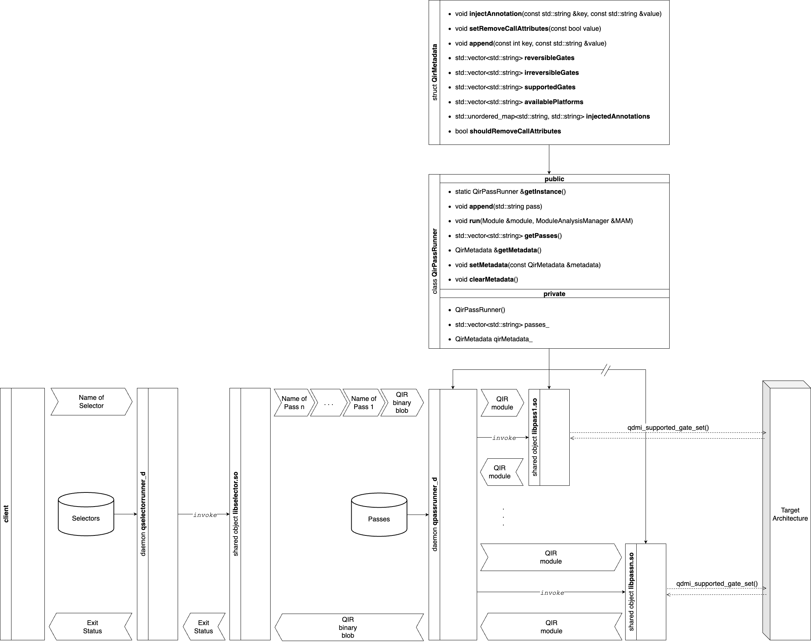

# qpassrunner_d (QIR Pass Runner daemon)

`qpassrunner_d` is a daemon for executing LLVM passes on a Quantum Circuit described on a Quantum Intermediate Representation (QIR). This README provides instructions for compiling, installing, and uninstalling the `qpassrunner_d`.

## Compilation

Before you can install `qpassrunner_d`, you need to compile the project. To do this, follow the steps below:

1. Install the required dependencies:
   ```bash
   sudo apt install -y cmake llvm libopenmpi-dev g++
   ```

2. Compile the chosen Quantum Device Management Interface (QDMI), for example:
   - Navigate to the `qdmi` directory which contains a dummy QDMI:
      ```bash
      cd qdmi
      ```

   - Create a `build` directory:
      ```bash
      mkdir build/
      cd build/
      ```

   - Configure the project using CMake:
      ```bash
      cmake ..
      ```
   - Build the project and return to the `qir_passes` directory: 
      ```bash
      make
      cd ../..
      ```

3. Create a `build` directory:
   ```bash
   mkdir build/
   cd build/
   ```

4. Set the CMake prefix path to locate LLVM's CMake configuration:
   ```bash
   export CMAKE_PREFIX_PATH=$(llvm-config --libdir)/cmake/llvm
   ```

5. Configure the project using CMake, specifying the custom executable name and the path to the chosen QDMI compiled in step 1:
   ```bash
   cmake -DCUSTOM_EXECUTABLE_NAME=qpassrunner_d -DCUSTOM_QDMI_PATH=qdmi ..
   ```

5. Build the project:
   ```bash
   cmake --build .
   ```

## Installation

Once the project is compiled, you can install `qpassrunner_d` system-wide with the following steps:

1. Navigate to the `build` directory (if you are not already there):
   ```bash
   cd build/
   ```

2. Install `qpassrunner_d` using sudo to ensure the necessary permissions for system-wide installation:
   ```bash
   sudo make install
   ```

`qpassrunner_d` should now be installed and ready to use on your system.

## Uninstallation

If you ever need to uninstall `qpassrunner_d`, follow these steps:

1. Navigate to the `build` directory (if you are not already there):
   ```bash
   cd build/
   ```

2. Run the uninstall target using sudo:
   ```bash
   sudo make uninstall
   ```

This will remove `qpassrunner_d` from your system.

## Documentation and Resources

This section provides links to project documentation and additional resources:

- [Documentation](https://lrz-qct-qis.gitlabpages.devweb.mwn.de/quantum_intermediate_representation/qir_passes/files.html): Detailed documentation about the `qpassrunner_d` project.
- [Wiki](https://gitlab-int.srv.lrz.de/lrz-qct-qis/quantum_intermediate_representation/qir_passes/-/wikis/home): Project wiki with additional information and guides.
- [Contributing Guidelines](CONTRIBUTING.md): Document to understand the process for contributing to our project.
- Flowchart of the QIR Pass Runner daemon: 


## Building Documentation

You can build the documentation locally using Doxygen. 

1. If Doxygen is not installed, you can install it with the following steps:

   - Install the required dependencies for Doxygen:
     ```bash
     sudo apt install -y flex bison
     ```

   - Clone the Doxygen repository:
      ```bash
      git clone https://github.com/doxygen/doxygen.git
      ```
   
   - Create a `build` directory
      ```bash
      cd doxygen
      mkdir build/
      cd build/
      ```
   
   - Run cmake with the makefile generator
      ```bash
      cmake -G "Unix Makefiles" ..
      make
      sudo make install
      cd ../..
      rm -rf doxygen
      ```

2. If Doxygen is already installed you can continue with the following steps:

   - Generate the documentation with Doxygen:
      ```bash
      doxygen Doxyfile
      ```
   
   - Open the generated documentation in a web browser:
      ```bash
      xdg-open documentation/html/index.html
      ```

Alternatively, you can manually open the file `documentation/html/index.html` with your preferred web browser.

## Running Examples

You can run the QIR Pass Runner daemon and a dummy selector as follows:

1. If `qpassrunner_d` is already installed:

   - Simply run the QIR Pass Runner daemon:
     ```bash
     qpassrunner_d
     ```

2. If `qpassrunner_d` is not installed, you can either 1) install it as described in the [Installation Section](#installation) and run it as shown in the above step or 2) compile it as explained in the [Compilation Section](#compilation) and then run it as follows:

   - Navigate to the `qir_passes` directory (if you are not already there):
     ```bash
     cd qir_passes/
     ```

   - And run the QIR Pass Runner daemon:
     ```bash
     ./qpassrunner_d
     ```

3. To compile and run the Selector Runner daemon, navigate to the `selector` directory using a second terminal:
   ```bash
   cd qir_passes/selector/
   ```

4. Create a `build` directory:
   ```bash
   mkdir build/
   cd build/
   ```

5. Install the required dependencies:
   ```bash
   sudo apt install -y cmake
   ```

6. Configure the project using CMake, specifying the custom executable name:
   ```bash
   cmake -DCUSTOM_EXECUTABLE_NAME=qselectorrunner_d ..
   ```

7. Build the project:
   ```bash
   cmake --build .
   ```

8. Run the QIR Selector Runner daemon:
   ```bash
   ./qselectorrunner_d
   ```

9. To compile and run a test client for submitting a Quantum Circuit described in QIR to the `qpassrunner_d` daemon, as well as a toy pass selector, navigate to the `tests` directory using a third terminal:
   ```bash
   cd qir_passes/tests/
   ```

10. Compile the test client using mpic++:
    ```bash
    mpic++ -std=c++14 test.cpp -o test
    ```

11. Run the test client:
    ```bash
    ./test
    ```

