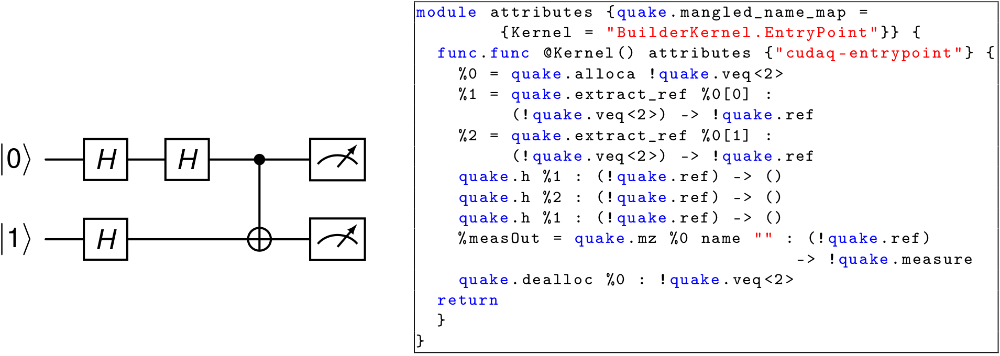
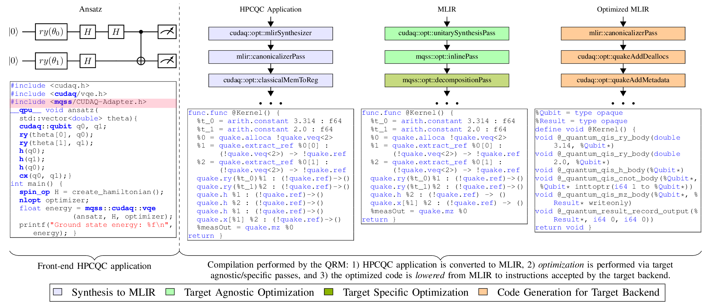
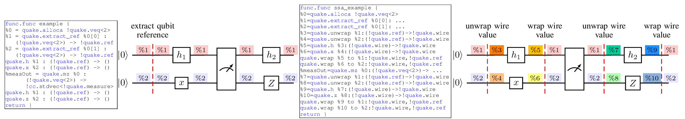

<!----------------------------------------------------------------------------
Copyright 2024 Munich Quantum Software Stack Project

Licensed under the Apache License, Version 2.0 with LLVM Exceptions (the
"License"); you may not use this file except in compliance with the License.
You may obtain a copy of the License at

https://github.com/Munich-Quantum-Software-Stack/passes/blob/develop/LICENSE

Unless required by applicable law or agreed to in writing, software
distributed under the License is distributed on an "AS IS" BASIS, WITHOUT
WARRANTIES OR CONDITIONS OF ANY KIND, either express or implied. See the
License for the specific language governing permissions and limitations under
the License.

SPDX-License-Identifier: Apache-2.0 WITH LLVM-exception
---------------------------------------------------------------------------->

  <picture>
    <source media="(prefers-color-scheme: dark)" srcset="./docs/_static/mqss_logo_dark.svg" width="20%">
    
  </picture>

# Collection of MLIR Passes of the MQSS

<!-- [DOXYGEN MAIN] -->

This repository holds a collection of MLIR passes that operate on Quantum programs to optimize,
transform, and lower quantum circuits to instructions compliant with the target devices. The presented
passes are integrated into the Munich Quantum Software Stack (MQSS) infrastructure. In particular,
this collection of passes is used in the Quantum Resource Manager (QRM) to optimize, transform, and
lower quantum programs to quantum devices. The passes stored in this collection can be classified as
target-agnostic and target-specific. Target agnostic passes can be applied to any quantum circuit and
do not require information on the selected quantum target device. In contrast, target-specific passes
tightly depend on the selected quantum device. For instance, transpilation passes that convert a quantum
circuit defined using arbitrary gates to a quantum circuit compliant with the native gate set of the
selected quantum device.

<!-- [DOXYGEN MAIN] -->

  

## FAQ

<!-- [DOXYGEN FAQ] -->

### What is MQSS?

**MQSS** stands for _Munich Quantum Software Stack_, which is a project of the _Munich Quantum
Valley (MQV)_ initiative and is jointly developed by the _Leibniz Supercomputing Centre (LRZ)_
and the Chairs for _Design Automation (CDA)_ and for _Computer Architecture and Parallel Systems
(CAPS)_ at TUM. It provides a comprehensive compilation and runtime infrastructure for on-premise
and remote quantum devices, supports modern compilation and optimization techniques, and enables
current and future high-level abstractions for quantum programming. This stack is designed to
deploy in various scenarios via flexible configuration options, including stand-alone scenarios
for individual systems, cloud access to multiple devices, and tight integration into HPC
environments supporting quantum acceleration. A concrete instance of the MQSS is deployed at the
LRZ for the MQV, serving as a single access point to all of its quantum devices via multiple
compatible access paths, including a web portal, command line access via web credentials as well
as the option for hybrid access with tight integration with LRZ's HPC systems. It facilitates
the connection between end-users and quantum computing platforms by its integration within HPC
infrastructures, such as those found at the LRZ.

### What is MLIR?

MLIR (Multi-Level Intermediate Representation) is a versatile compiler framework for developing
domain-specific compilers and optimizing transformations. MLIR originated as part of the LLVM
ecosystem and is particularly tailored for modern, complex computational workflows, including
machine learning, AI, and heterogeneous hardware.

MLIR supports multiple levels of abstraction within a single framework, allowing developers to
work with high-level domain-specific operations down to hardware-specific operations. Users can
define their **dialects** (custom operations and types) for specific problem domains while leveraging
the shared infrastructure for optimization and code generation already provided by MLIR.

    

Additionally, MLIR promotes interoperability among different models of computation and supports
**optimization passes** across various abstraction levels, including high-level and low-level
operations.

For more information on [MLIR](https://github.com/llvm/llvm-project.git).

### What is an MLIR Dialect?

An MLIR dialect is a modular and extensible namespace within the MLIR framework that defines a set of
**operations**, **types** and **attributes** specific to a domain, language, or model of computation. Dialects
enable MLIR to be a highly flexible intermediate representation (IR).

For instance, **Quake** is an MLIR dialect designed for quantum computing. It serves as part of NVIDIA's CUDAQ framework,
facilitating the development, optimization, and deployment of quantum-classical hybrid programs. Quake represents
quantum programs within MLIR, providing a high-level abstraction for quantum operations and allowing developers to
leverage the MLIR infrastructure for optimization and compilation.
Below is an example of a quantum circuit and its corresponding representation using Quake. Each instruction at MLIR
level matches the gates represented in the diagram. Though, at first, this representation might resemble other
representations such as QASM and QIR, there exists a difference in the flexibility of the representation that allows
transformations at different levels of abstraction, which is provided by the MLIR framework.

    

For more information on [QUAKE MLIR Dialect](https://github.com/NVIDIA/cuda-quantum.git).

### What is an MLIR pass?

An MLIR pass is a transformation or analysis applied to an MLIR intermediate representation (IR) to 
**modify**, **optimize**, or **gather information**. Passes are a central concept in compiler
frameworks, including MLIR, enabling modular, reusable,and extensible code transformations at
various abstraction levels.

    

For instance, in the figure above, an MLIR optimization pass is applied to the input example circuit,
which contains two consecutive Hadamard gates on qubit 0. Accordingly, in the output-optimized circuit
shown on the right, those two consecutive Hadamards are removed because they are equivalent to an
identity operation.

MLIR has two categories of passes: **transformation** passes and **analysis** passes. The pass 
presented above is a transformation pass. Moreover, passes can be applied in sequences defined
as **pass pipelines**.

    

In the figure shown above, three pass pipelines are defined. In purple, a synthesis to QUAKE pipeline
synthesizes QUAKE MLIRcode from a given input C++ program. In green, an optimization pipeline that
applies a series of transformations passes on MLIR modules. Finally, in orange, a pass pipeline that
lowers QUAKE MLIR modules to the Quantum Intermediate Representation (QIR).

The compiler converts the high-level HPCQC application to MLIR and forwards the quantum circuits to
the QRM. Then, the QRM represents the quantum circuits as quantum kernels using the MLIR dialect Quake
(see purple blocks). Optimization involves applying a pipeline of target-agnostic and target-specific
passes that transform the input quantum circuit into an optimized version (see green blocks) that is
compliant with the target device. Finally, the optimized MLIR/Quake circuit is lowered to a program
with instructions accepted by the selected target backend (see orange blocks). In this example, the
optimized MLIR code is lowered to QIR. Note that the code presented here is not functional and is
only for illustrative purposes.

### Why include MLIR into the MQSS?

One fundamental feature of MLIR is its ability to model different levels of abstraction related to a
domain-specific language. In contrast, Quantum representations such as the QIR or QASM are
instruction-level representations. Performing transformations on a low-level abstraction, such as
instruction-level, might not be a good choice. Instruction-level representations are a list of quantum
gates that operate on qubits. 
The figure below shows a non-compliant and a compliant SSA MLIR/Quake quantum kernel on the left and
right, respectively. The problem with using representations that do not expose the data dependencies,
as shown on the left and QIR, is that the compiler might apply incorrect transformations during
optimization.

    

The representation presented on the left assumes a value referencing each qubit. Values %1 and %2
correspond to qubits 1 and 2, respectively. By following only the value %1, the compiler might
wrongly assume that h1 has produced the value %1 and is immediately consumed by h2.
The compiler will try to remove gates h1 and h2 since two consecutive Hadamard gates result in
an identity. However, following this assumption, the compiler could ignore the fact that a measurement
exists between the two gates. Thus, representations using values referencing qubits might not be a
good choice when applying transformation that relies on the data dependencies among gates. In contrast,
as presented on the figure's right, an SSA-compliant representation exposes the data dependencies
without ambiguity since each gate consumes/produces values.
These values can also be visualized as the wires connecting the gates in the quantum circuit. A color
code distinguishes the different values for clarity. Note that measurements might require wrapping and
unwrapping the wires since they must operate on qubit references, i.e., values %1 and %2.
There, gate h1 consumes the value %3, corresponding to unwrapping the qubit reference value %1 and
producing the value %5. Gate h2 consumes the value %7, which corresponds to unwrapping the qubit
reference value %1 after the measurement. Accordingly, there is no ambiguity in the representation,
and eliminating h1 and h2 is impossible because both gates reference different values at their output
and input, respectively. The representation presented on the left assumes a value referencing each
qubit. Values %1 and %2 correspond to qubits 1 and 2, respectively. By following only the value %1,
the compiler might wrongly assume that h1 has produced the value %1 and is immediately consumed
by h2.
The compiler will try to remove gates h1 and h2 since two consecutive Hadamard gates result in an
identity. However, this assumption could ignore that a measurement exists between the two gates.
Thus, representations using values referencing qubits might not be a good choice when applying
transformation that relies on the data dependencies among gates. In contrast, as presented on the
right of Fig. 4, an SSA-compliant representation exposes the data dependencies without ambiguity
since each gate consumes/produces values. 
These values can also be visualized as the wires connecting the gates in the quantum circuit. 
A color code distinguishes the different values for clarity. Note that measurements might require
wrapping and unwrapping the wires since they need to operate on qubit references, i.e., values
%1 and %2.
There, gate h1 consumes the value %3, corresponding to unwrapping the qubit reference value %1,
and producing the value %5. Gate h2 consumes the value %7 corresponding to unwrapping the qubit
reference value %1 after the measurement. Accordingly, there is no ambiguity in the representation,
and eliminating h1 and h2 is impossible because both gates reference different values at their
output and input, respectively.

### Where do MLIR passes fit into the MQSS?

The collection of MLIR passes stored in this repository is part of the Munich Quantum Software Stack
(MQSS). The passes are utilized inside the Quantum Resource Manager
([QRM](https://github.com/Munich-Quantum-Software-Stack/QRM)).

    

For example, a hybrid quantum application can be defined in a high-level programming language such
as C++ using the CUDAQ library. Those code fragments in a hybrid quantum application defined as
quantum kernels will be submitted to the QRM.

By specifying the target as MQSS at compilation time, the generated binary will orchestrate the
classical and quantum resources. Every time a quantum kernel has to be executed, the compiled binary
submits the MLIR code of the correspondent quantum kernel to the MQSS stack. Thus, on the MQSS side,
the MLIR module is processed by the QRM, which perform **agnostic passes** (optimization passes) and
**target-specific passes** (transpilation passes and lowering passes). The lowered code is sent to
the Quantum device, and the results are collected and sent back to the hybrid application.

### Where is the code?

The code is publicly available and hosted on GitHub:
https://github.com/Munich-Quantum-Software-Stack/passes.

### Under which license is this collection of passes released?

This collection of MLIR passes is released under the Apache License v2.0 with LLVM Exceptions. See
[LICENSE](https://github.com/Munich-Quantum-Software-Stack/passes/blob/develop/LICENSE) for more
information. Any contribution to the project is assumed to be under the same license.

<!-- [DOXYGEN FAQ] -->
