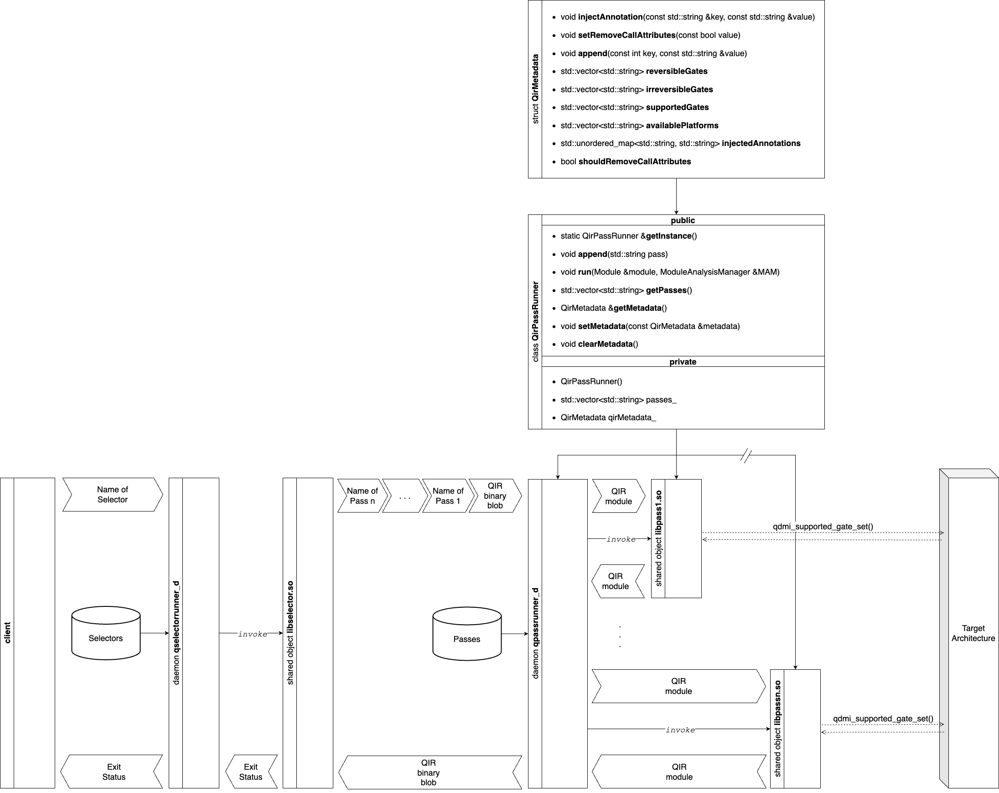

# Quantum Resource Manager (QRM)

The entry point of the Quantum Resource Manager for selecting and applying LLVM passes to a Quantum Circuit described on a Quantum Intermediate Representation ([QIR](https://www.qir-alliance.org/projects/)) is the `daemon_d` daemon . This README provides instructions for compiling<!--, installing, and uninstalling the--> `daemon_d`.

## Compilation and Installation

<!--Before you can install `daemon_d`, you need to compile the project. To do this, follow the steps below:-->

To install the Quantum Resource Manager daemon system wide, follow these steps:

1. Install the required dependencies:
   ```bash
   sudo apt install -y cmake llvm rabbitmq-server g++
   ```

2. Navigate to the `qir_passes` directory (if you are not already there):
   ```bash
   cd qir_passes/
   ```

3. Run make specifying the installation path ($HOME is set as default):
   ```bash
   make INSTALL_PREFIX=$HOME install
   ```

## Uninstallation

If you ever need to uninstall `daemon_d`, follow these steps:

1. Navigate to the `qir_passes` directory (if you are not already there):
   ```bash
   cd qir_passes/
   ```

2. Run the uninstall target using sudo:
   ```bash
   sudo make uninstall
   ```

This will remove `daemon_d` from your system.

## Documentation and Resources

This section provides links to project documentation and additional resources:

- [Documentation](https://lrz-qct-qis.gitlabpages.devweb.mwn.de/quantum_intermediate_representation/qir_passes/files.html): Detailed documentation about the Quantum Resource Manager.
- [Wiki](https://gitlab-int.srv.lrz.de/lrz-qct-qis/quantum_intermediate_representation/qir_passes/-/wikis/home): Project wiki with additional information and guides.
- [Contributing Guidelines](CONTRIBUTING.md): Document to understand the process for contributing to our project.
<!--
- Flowchart of the QIR Pass Runner daemon: 

-->

## Building Documentation

You can build the documentation locally using Doxygen. 

1. Install the required dependencies for Doxygen:
   ```bash
   sudo apt install -y flex bison
   ```

2. Run make:
   ```bash
   make docs
   ```

3. Open the generated documentation in a web browser:
   ```bash
   xdg-open documentation/html/index.html
   ```

Alternatively, you can manually open the file `documentation/html/index.html` with your preferred web browser.

## Running Examples

You can run the Quantum Resource Manager daemon and a test client as follows:

1. Install `daemon_d` as shown above. 
   - Then simply run the daemon specifying a path for the log file:
   ```bash
   daemon_d log ${HOME}
   ```

   - One may also run the daemon specifying the terminal as the standard output stream and no log file:
   ```bash
   daemon_d screen
   ```

2. To compile and run a test client for submitting a Quantum Circuit described in QIR to the daemon, navigate to the `tests` directory using a second terminal:
   ```bash
   cd qir_passes/tests/
   ```

3. Compile the test client:
   ```bash
   g++ test.cpp ../src/connection_handling.cpp -o test -lrabbitmq
   ```

4. Run the test client:
   ```bash
   ./test
   ```

